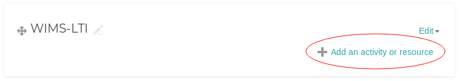
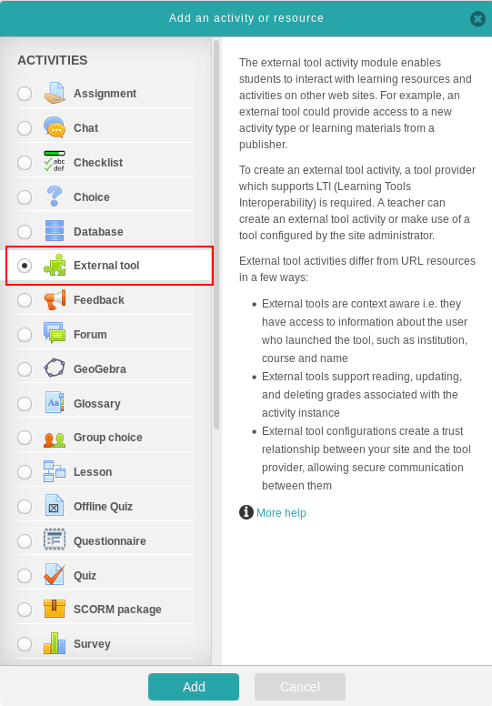
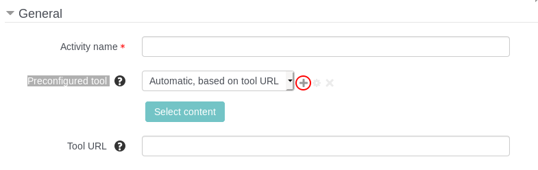
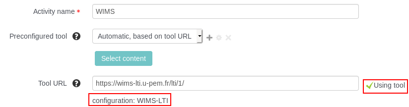

# Example of LTI Activity Creation

## Moodle

### Create an LTI Activity

The creation LTI activity on Moodle is pretty straightforward :

1. Go on the Course you wish to create a LTI activity in.
2. Click on *"Add an activity or resource"* iin a section :
    
    

3. In the popup, choose *"External Tool"* :

    

4. Fill the following fields in the form:
    
    * `Activity name` : The name that will be displayed in your Moodle's course.
    * `Tool URL` : The **LTI URL** your obtained on *WIMS-LTI*.
    * `Launch container`: *New window* (open in a new tab) or *Existing windown*.
    * `Consumer key`: The **key** defined when adding your LMS to *WIMS-LTI*.
    * `Shared secret`: The **secret** defined when adding your LMS to *WIMS-LTI*.

5. Save by clicking on *Save and return to course*.

### Create a preconfigured tool

A preconfigured tool allow to create an LTI activity faster by having to fill only
the `Activity name` and `Tool URL` in the activity creation's form.

There is two kind of preconfigured tools: **Global tools** and **Course tools**, only
the administrators of your Moodle can add **Global tools**, so you should
ask them to add one.

To create a new course tool, once in the activity creation form (step **4.**), click on the **+** sign on
the `Preconfigured tool` line :

And fill these mandatory fields:

* `Tool URL` : The home page of your WIMS-LTI server, for instance: `https://wims-lti.u-pem.fr/`.
* `Consumer key`: The **key** defined when adding your LMS to *WIMS-LTI*.
* `Shared secret`: The **secret** defined when adding your LMS to *WIMS-LTI*.
* `Launch container`: *New window* (open in a new tab) or *Existing windown*.

Then click on *Save changes*.

Once the preconfigured tool has been created, the field *Consumer key*, *Shared secret* and
*Launch container* will be automatically fill as soon as a LTI URL from the same
WIMS-LTI server is entered in the *Tool URL* field.

If your preconfigured tool has been detected, your should see
*"Using tool configuration [tool_name]"* after the *Tool URL* field :

