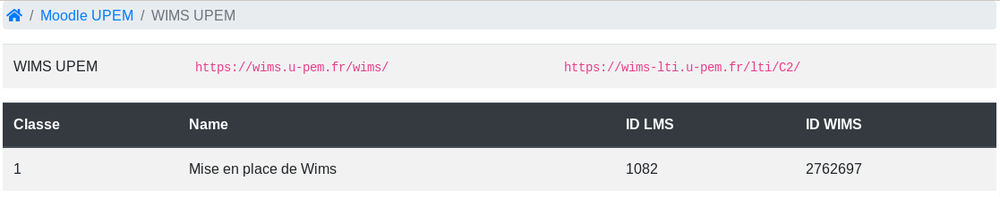
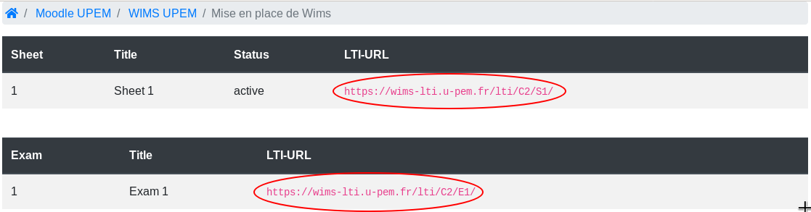

## Creating classes

***New Class***

To create a new class through LTI, teacher only need to create an **LTI activity** on their LMS' course.
The WIMS' class will be automatically created as soon as a **teacher** of the LMS' course click
on the LTI activity.  
In similar manner, Users will be created every time a new user click on the activity.

To create a LTI activity, teacher will need :

* a **LTI URL**.
* their **LMS' key**.
* their **LMS secret**.

The LMS' **key** and **secret** has been defined when adding the LMS to WIMS-LTI, so you should ask
the person in charge of your WIMS-LTI server to have them.

Most of the LMS allow the creation **preconfigured tools**, this allow the **key** and **secret**
to be automatically set according to a base URL.

You can see example of LTI activity and preconfigured tool creation for different LMS [here](/activity_creation_example).

To obtain a **LTI URL**, teachers can go to the home page of their WIMS-LTI server, search for
their LMS, and copy the link of the WIMS server they want to create a class on :


If the WIMS server they want does not appear after clicking on their LMS, its either because the
WIMS server has not been added to WIMS-LTI or it does not have authorized your LMS. You should
contact your WIMS-LTI administrator to solve this problem.


***Copying an Existing Class***

It is (for now) not possible to duplicate an existing class when creating a new class through LTI.
A workaround is to create a backup if your existing class through
`configuration` -> `Config/Maintenance` -> `Backup and restoration` -> `Backup of the class`.

Choose the format you want and what you want to copy. It is recommended to not copy participants
accounts (and related contents) as their is no way to link WIMS' existing user to your LMS' user
through LTI.

Once your backup is created, create a new class through LTI as above, go back to 
`configuration` -> `Config/Maintenance` -> `Backup and restoration` -> `Restoration from a backup`
and choose your backup archive.


***Custom LTI Parameters: ***

When creating a new class, a number of custom LTI parameters can be added to change some
of the settings of the created class and its supervisor:

* Class
    * `custom_class_name` - Name of the class (default to the LMS course name)
    * `custom_class_institution` - Name of the Institution (default to the LMS institution)
    * `custom_class_email` - Email of the class (default to the creator's email)
    * `custom_class_lang` - Language of the class (en, fr, es, it, etc - default to the LMS' language).
    * `custom_class_expiration` - Expiration date (yyyymmdd - default to 11 months).
    * `custom_class_limit` - Maximum number of participants in the class (from 10 to 500, default to 150).
    * `custom_class_level` - Level of the class (E1, ..., E6, H1, ..., H6, U1, ..., U5, G, R - default to U1).
    * `custom_class_css` - CSSfile (must exists on the WIMS server).

* Supervisor:
    * `custom_supervisor_lastname` - Last name of the supervisor
    * `custom_supervisor_firstname` - First name of the supervisor
    * `custom_supervisor_email` - Email adress of the supervisor

I.E.:
```text
custom_class_lang=en
custom_class_name=Best class in the world
custom_class_email=address@email.com
```

For some LMS (*Moodle* for instance), `custom_` will be added automatically, so only the second part is necessary:
```text
class_lang=en
class_name=Best class in the world
class_email=address@email.com
```


## Send the grade back to the LMS

Once your class has been created through LTI, it will appear on WIMS-LTI :



Click on it to see the list of worksheets and exams created in
this class, and their respective LTI URL :



With these LTI URLs, you can now create LTI activities on your LMS.

To send the grade of the worksheet / exam from WIMS to the LMS, you only
need to click on the corresponding LTI activity as a teacher. In other words, WIMS-LTI will send
the grade of every user who clicked on *activity A* every time a teacher click on *activity A*.

*Caution :* Only the grade of the **user who clicked at least once** on the link corresponding
to the worksheet / exam will have their grade sent to the LMS. If an user
has completed an <font color='blue'>**activity B**</font> using the LTI link of
<font color='red'>**activity A**</font> (which is possible since the user is free to move once
connected to WIMS), WIMS-LTI will not be able to sent his grade
of <font color='blue'>**activity B**</font>.

***However***, if the user click on the LTI link of <font color='blue'>**activity B**</font>,
even after finishing it through the LTI link of <font color='red'>**activity A**</font>,
WIMS-LTI will be able to sent the correct grade of <font color='blue'>**activity B**</font>.

___

For worksheets, the grade sent back to the LMS can differs according to the version of your WIMS server. For versions 
prior to, and including 4.18, it is the `cumul` value (*i0*), for the latest version, it is the score computed according
to the formula chosen by the teacher at the worksheet's creation.


## Get the grade of an already existing WIMS class

It is not possible to send the grade of an already existing WIMS class (not created
through WIMS-LTI) to a LMS because, as stated above, their is no way to link WIMS'
existing user to your LMS' user through LTI.
